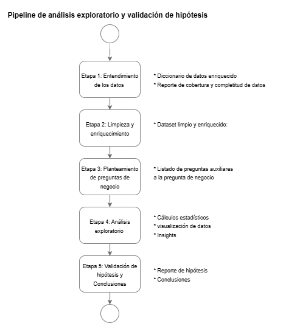

# MINE4213-Taller1
Presentado por:
- Juan Manuel Rivera  - 201534131
- Johana Alejandra Rátiva - 202513844
# Objetivo

El objetivo de este cuadernillo es analizar el comportamiento de la demanda de ocupación hotelera con el fin de tomar decisiones acertadas en torno a la politica de precios, gestión de cancelaciones y anticipación de las reservas. Para ello vamos a implementar un pipline de analisis de datos.

# Alcance

Para llevar a cabo este análisis se implementó un pipeline de 4 etapas. En cada una de ellas se obtuvieron productos relevantes para el negocio:

Etapa 1 – Entendimiento del dataset: se construyó un diccionario de datos enriquecido, un reporte de cobertura y completitud, así como un análisis de la dimensionalidad del dataset. También se identificaron y priorizaron atributos clave (**hotel**, **is_canceled**, **lead_time**, **adr**, **arrival_date_month**).

Etapa 2 – Limpieza y enriquecimiento: se obtuvo un dataset limpio con atributos derivados (**tipo_reserva**, **estación_año**, **price_gap_vs_resort**), garantizando la calidad y utilidad de la información.

Etapa 3 – Estrategia de análisis: se plantearon preguntas guía relevantes para el negocio, tales como:

* ¿Existe una diferencia en el número de cancelaciones entre hoteles tipo Resort y hoteles de ciudad?
* ¿Existe una relación entre la cancelación y el precio de la reserva?
* Existe una relación entre el precio de la reserva y el tipo de hotel?
* ¿Existe una relación entre la cancelación y la época del año?

Etapa 4 – Análisis estadístico: se aplicaron análisis univariados, bivariados y pruebas de estadística inferencial, que permitieron perfilar el comportamiento de las reservas hoteleras.

Finalmente, logramos identificar insights que pueden apoyar la toma de decisiones estratégicas en relación con la política de precios, con el objetivo de mejorar la tasa de ocupación hotelera mediante la disminución de cancelaciones.

# Conclusiones (insights)

A partir de un dataset inicial de 58.895 registros y 33 variables correspondientes a reservas de una cadena hotelera, se identificó que:

* Las reservas tienden a concentrarse en hoteles tipo resort, en comparación con los hoteles de ciudad.
* Existe un grupo relevante de personas que accede a los hoteles el mismo día de la reserva; sin embargo, en general las reservas muestran una tendencia hacia la planeación a largo plazo.
* Este patrón sugiere que el dataset refleja principalmente un perfil de usuarios que prefieren la cadena hotelera para viajes de ocio en hoteles tipo resort.
* En contraste, los hoteles de ciudad presentan un escenario más desafiante debido a que la proporción de cancelaciones es considerablemente más alta.

El análisis detallado permitió identificar que:

* Las cancelaciones en hoteles de ciudad se intensifican durante verano y primavera, coincidiendo con periodos de mayor demanda.
* En estas temporadas los precios tienden a ser más elevados, pero la diferencia entre hoteles de ciudad y resorts no es significativa.
* Esto genera que reservas hechas con mayor anticipación en hoteles de ciudad se cancelen con frecuencia, dado que los clientes encuentran ofertas de último minuto en resorts que resultan más atractivas y competitivas.

Recomendación estratégica

* Se sugiere ajustar la política de precios de los hoteles de ciudad, particularmente en temporadas de alta demanda (verano y primavera), con el fin de:

* Ampliar la brecha de precios respecto a los resorts, ofreciendo tarifas más competitivas.

* Favorecer reservas anticipadas en resorts, manteniendo incentivos atractivos para quienes planifican con antelación.

* Impulsar reservas de último minuto en hoteles de ciudad, convirtiéndolos en una alternativa flexible y económica frente a los resorts.

De esta manera, se busca disminuir la tasa de cancelación en hoteles de ciudad y mejorar su ocupación, ajustando la estrategia de precios de acuerdo con el comportamiento real de los clientes.

# Instrucciones de ejecución

El análisis completo se encuentra implementado en el cuaderno taller_1.ipynb, el cual contiene todas las etapas del pipeline descrito (entendimiento, limpieza, enriquecimiento, análisis exploratorio y pruebas estadísticas).

Como complemento se entrega un informe ejecutivo en formato pdf.

# Dependencias

Antes de la ejecución asegurarse de tener las librerias 

pandas
numpy
matplotlib
seaborn
scipy
