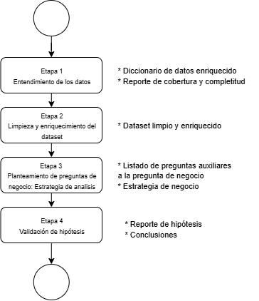

# MINE4213-Taller1
Presentado por:
- Juan Manuel Rivera  - 201534131
- Johana Alejandra Rátiva - 202513844
# Objetivo

El objetivo de este cuadernillo es analizar el comportamiento de la demanda de ocupación hotelera con el fin de tomar decisiones acertadas en torno a la politica de precios, gestión de cancelaciones y anticipación de las reservas. Para ello vamos a implementar un pipline de analisis de datos.

# Alcance

Para llevar a cabo este analisis se ejecutó un pipline de 4 etapas en donde cada una de ellas entrega un producto para el negocio. La etapa 1 de entendimiento de los datos obtiene como resultado un diccionario de datos enriquecido y un reporte de cobertura y completitud de cada uno de los atributos del dataset. 

En la etapa 1 se busca entender las dimensiones y completitud del dataset junto con su comportamiento en contraste con el diccionario de datos proporcionado. Para ello, se identificará en primera instancia el tipo de dato técnico leído al importar el dataset (por ejemplo, int, float, object o boolean en Python). Posteriormente, se realizará una clasificación estadística de las variables, distinguiendo entre cualitativas nominales, cualitativas ordinales, cuantitativas discretas y cuantitativas continuas, con el fin de orientar adecuadamente los análisis posteriores. Fruto de este primer acercamiento a los datos se entienden las necesidades de limpieza y ajuste inicial, actividades que se realizaran en la etapa 2, en donde se priorizan variables como hotel, is_canceled,lead_time,arrival_date_month, deposit_type y adr, para a partir de ellas realizar un enriquecimiento y limpieza de los datos.
En la etapa 3 buscamos direccionar el analisis a partir del planteamiento de preguntas complementarias a las de negocio, las cuales nos van a permitir abordar de manera efectiva el analisis exploratorio de los datos, estas preguntas son:

- Hay más cancelaciones en la ciudad o en el campo -> chi
- En que meses hay mayor ocupación/reservas?
- El tipo de reserva está relacionado con si se cancela o no la reserva
- Influye el tipo de depósito en la reserva?
- Influye el costo en las cancelaciones? -> t test, regresión log
- Las cancelaciones estan concentradas en algunos meses?
- ¿Cómo influye el tiempo de antelación a la cancelación de la reserva? -> t test, regresión log
- Las cancelaciones previas están correlacionadas con que se cancele la reserva (previous cancelations and previous not canceled)

Para dar respuesta a estas preguntas utilizaremos calculos de estadisticas descriptivas y de visualización univaraida y bivariad que se llevaran a cabo en la etapa 4. (...)

Posteriormente y de manera complementaria bsucaremos realizar las pruebas de hipotesis pertinentes que nos permitiran brindar conclusiones y sugerencias para el negocio.

# Conclusiones (insights)

# Instrucciones de ejecución

# Dependencias
